<p align="center">
    
</p>

```yaml
Name: Kavisha Kushwah
Role: AI & Full-Stack Developer
Education: B.Tech CSE (AI & ML)
Learning: Agentic AI, RAG, MERN
Focus: DSA & Projects
Goal: Building impactful AI applications.
```
## 💻 Tech Stack

### Languages


### Frontend


### Backend


### Database


### AI / Machine Learning


### Tools


## Socials:
[](https://leetcode.com/u/Kavishakushwah06/)
[](https://www.linkedin.com/in/kavisha-kushwah-318749295)
[](mailto:kavishakushwah07@gmail.com)
